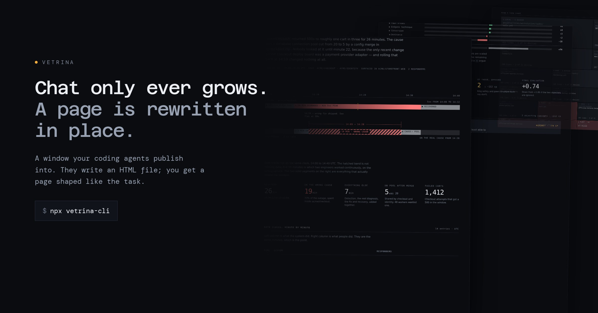

# Vetrina

**A window your coding agents publish into.**



*Vetrina*, Italian, the shop window. Redressed constantly, arranged for what is being sold today, and nobody expects last week's display to still be there.

| | |
|---|---|
| **What** | Agents write an HTML file. You get a page shaped like the task. |
| **Why** | Chat only ever grows. A page is rewritten in place. |
| **For** | Anyone running Claude Code, Codex or Cursor, especially several at once. |
| **How** | `npx vetrina-cli`. No SDK, no config, no account, no dependencies. |
| **Not** | A dashboard, a kanban, a session monitor. It has no fixed shape. |
| **Status** | Daemon, kit and skill all built and shipped. Not launched. |

## Setup

Teach your agents, once:

```
npx skills add -g flaviolivolsi/vetrina
```

Open the window, and leave it running:

```
npx vetrina-cli
```

That is the whole of it. The skill tells any agent when a page beats a paragraph, which shape to reach for, and, most of the time, to say it in two sentences and build nothing. It installs wherever your tools keep skills, so it is not Claude-specific.

## One window, every project

**Run `npx vetrina-cli` from anywhere. It does not care what directory you are in, and you only ever need one.**

There is a single window at `~/vetrina`, on one port, at one URL you bookmark once. Every project publishes into it. Each subdirectory is a **space**, and the index groups and filters by space, so five projects and five agents are five filter chips rather than five tabs.

```
~/vetrina/
  checkout-api/     incident-oct-4.html      ← one project
  vetrina/          launch-readiness.html    ← another
  research/         vendor-comparison.html   ← not a project at all
```

An agent publishes by writing a file into `~/vetrina/<space>/<name>.html`. That is the entire API: no SDK, no client library, no registration, no per-project setup. Point it somewhere else with `--root` if you want a separate window for something, but the default is that you do not.

**Tailscale is optional.** With a tailnet, vetrina binds it and prints a QR code, so your phone reads the window from anywhere. Without one it binds loopback and tells you the two ways to reach it from another device. It never binds `0.0.0.0`.

---

## The problem

An hour with an agent leaves you with a pile. What it did. What it explained, at length. The asides you dropped in while it was busy with something else. The second task you started in the same thread. All interleaved in the order it happened rather than the order it matters, and none of it addressable. You cannot see just the migration, and you cannot find the thing you said forty minutes ago.

The pile only grows. Then multiply by every other conversation you have open.

## The mechanism

**A transcript only grows. A page is rewritten in place.**

A page is scoped to one task, and every time the work moves the agent rewrites it. It stays one screen and shows the current state, not the history of arriving at it. Nothing accumulates because there is nothing to append to.

That is why disposability is load-bearing rather than decorative. A page nobody is precious about can be thrown away and rebuilt, which is the only way it stays the size of the problem instead of the size of the session.

Nor is the agent summarising the transcript. **It never lost the structure.** It knows what shipped, which test failed, what the diff was. Chat is the thing that flattens all of that into prose on the way out. A page is that structure surviving the trip.

## Look at it

**These render as live pages, not as source.** Every link below opens the real thing.

Ten newer pages built with the design kit, on subjects with more in them:

| | |
|---|---|
| [Nxe5 wins the pawn and mortgages the king](https://vetrina.flaviolivolsi.com/gallery/01-eval-waterfall.html) | 32 named concepts scored a chess move; four decided it, and two pull against each other |
| [The outage lasted 26 minutes, the wrong theory lasted 19](https://vetrina.flaviolivolsi.com/gallery/04-incident-timeline.html) | two clocks on one axis, the lost time drawn as a hole |
| [Ten invariants have a file behind them, the two-hour promise has a habit](https://vetrina.flaviolivolsi.com/gallery/05-contract-annotated.html) | a contract marked in place against the code that enforces it |
| [Sync held for 47 writes and quietly dropped the one that mattered](https://vetrina.flaviolivolsi.com/gallery/06-sync-trace.html) | where a queued write forks, and which branch last-write-wins threw away |
| [Nobody ever came back to the backup question](https://vetrina.flaviolivolsi.com/gallery/09-parking-lot.html) | five asides dropped mid-task and what became of each. Two still unanswered |
| [One question, one screen](https://vetrina.flaviolivolsi.com/gallery/10-blocked.html) | 113 lines. Most of what the skill says is when *not* to build a page |

All ten in the [gallery](https://vetrina.flaviolivolsi.com/gallery/). **Real projects, invented data:** Gregario, Luxifare and Officina are mine, and the incidents and numbers in those pages are made up. The one page with an outage on it uses a fictional company on purpose.

And before any of that, ten pages built with **no design kit at all**. Those are the evidence rather than the showcase: they exist to answer whether an unaided agent produces something worth looking at, and they are deliberately untouched, unpolished and never restyled. Editing them to look nicer would stop them being an answer.

They are in [`evidence/`](evidence/) with the [scorecard](evidence/SCORECARD.md) that judged them, and served unstyled-by-intent at [/demos/](https://vetrina.flaviolivolsi.com/demos/09-fleet.html) if you want to see raw output rather than a gallery.

**Ten out of ten were good, and the caveat matters more than the score.** Every agent was handed an already-structured brief. So this proves agents *render* structure well when they have it. It does not prove they notice when a page beats a paragraph, or that they can find structure in a messy session. That is the open question, and everything else rests on it.

## Why not just a better dashboard

In May 2026 Claude Code shipped [agent view](https://code.claude.com/docs/en/agent-view): every session on the machine, grouped by *needs input* / *working* / *done*, with inline replies to blocked sessions. GitHub shipped Agent HQ. Cursor runs eight agents in worktrees.

Take that as evidence the pain is real. Then read what it actually shows: a session roster, grouped by state, where each row is the session name and a one-line summary of its current activity generated by a small model. It is Claude Code only, it is terminal only, and there is no mechanism in it for a page shaped like your task.

So *which agent needs me* is table stakes now. What is untouched is everything above. A migration does not become a before-and-after table, an incident does not become a timeline, a prompt does not become an annotated render. Nine of the ten pages have no counterpart in any shipped pane, and cannot, because a pane shipped to everyone has to be general.

Everyone else is building a better frame. This is a bet that there should not be one.

## How it works

- **One window at `~/vetrina`**, on a stable port, bookmarked once. Each subdirectory is a **space**: a project, an agent, a session. The index is newest-first with per-space filters.
- **One file is the whole API.** No SDK, no client library, no registration, no manifest. Anything that can write a file can publish: Claude Code, Codex, Cursor, Aider, a cron job, a CI run, a shell script.
- **Live reload** over server-sent events, injected into every page. The agent rewrites as work lands; the tab in your hand updates without a refresh.
- **Binds to your tailnet if you have one, else loopback.** Never `0.0.0.0`. There is no application-level auth, so the bind address is the entire security model. A public bind is refused rather than warned about.
- **An optional kit**, linked with one line and inlined at serve time, so a saved page is still self-contained. Its layout primitives have no width to get wrong, because every layout bug found in testing was something that could not shrink inside something that could not scroll.

## If your agents forget

A skill is offered once, in a list, at the top of a session. If you run long sessions and an agent reports in chat anyway, add one line to that project's `CLAUDE.md` or `AGENTS.md`, where standing context does not scroll away:

```
When you finish an audit, review, migration or investigation, publish a
vetrina page rather than a long chat report, unless the answer fits in
two sentences.
```

That is a pointer, not a policy. The skill holds the detail; this only keeps its existence in view. In testing it was not needed once the skill's own wording was fixed.

## Not

- **Read-only, today.** Pages are published, served and rewritten. Nothing is sent back. There is no endpoint, no `.actions.jsonl`, and no agent-side loop to consume one. Pages that answer back are the next thing this project wants and are not built. The honest blocker is that a write endpoint would let anything that can reach the daemon act on your behalf, which is a much bigger claim than serving files.
- Not a persistent dashboard, not analytics, not a deploy target.
- Not an orchestrator. The window carries what is true, never what to do.
- **Not a vault, and the pages are not harmless.** A page written about your work contains your work: file paths, code, architecture, log lines, customer names if they were in the output. Treat the root as you would the repo it describes. The daemon has no authentication at all, so the bind address is the entire access control: a tailnet, or loopback. Never put it on a network you do not control, and never on shared wifi.
- Not a replacement for the agent explaining itself. The page is where the detail lives so the words can be short.

## Status

The daemon, the kit and the skill all ship in [`vetrina-cli`](https://www.npmjs.com/package/vetrina-cli). Not launched, and one thing is honestly unfinished.

**The skill picks well, and getting it to fire took one rewrite.** Put in an agent's ambient list and given real tasks with no mention of vetrina, it chose the right shape every time it built a page, and correctly built nothing for a question that wanted one line. But on a pre-launch audit it found twenty findings across four severities, ordered them by urgency, and then typed all of it into chat without ever reaching for the skill.

That was a matching problem, not a taste problem. The description was written in the vocabulary of the *output* ("items in mixed states", "a comparison across dimensions"); the agent had just done something it would call an **audit**, and nothing in the list sounded like that. Rewriting the description to lead with the vocabulary of the *work* fixed it, and the identical task published on the re-run.

One failure before, one success after. Suggestive, not proof.

A third test asked whether the pages are *true*, and the answer was worse: ten pages passed every automated check and an adversarial read found a false or self-contradicting claim in every one. Machine-checkable constraints turn out to be necessary and nowhere near sufficient, which is written up in [`evidence/REASONING-AUDIT.md`](evidence/REASONING-AUDIT.md).

Full method and results in [`evidence/COLD-TEST.md`](evidence/COLD-TEST.md), including the task that had to be voided because the agent found the scorecard mid-run and said so.

MIT. The kit gets inlined into pages you keep and the skill gets copied into your own instructions, so the licence has to permit that without conditions attached.
